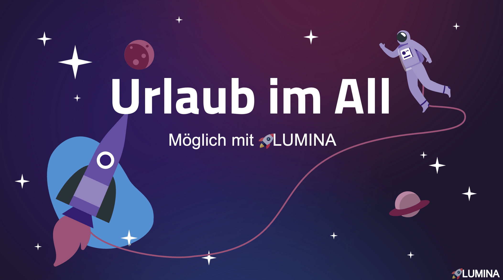

# LUMINA: *Raumfahrterlebnisse der Zukunft*

HWG Ludwigshafen – IBAIT ATdIT 2, Projektgruppe 3

***Entwicklung eines innovativen Softwaresystems für atemberaubende Erlebnisse im Weltraum.***

Dozierende: *Andreas Heck und Patrick Gutgesell*  
Gruppenmitglieder: *Leonie Bretscher, Vanessa Weber, Inas Mountassir, Oliver Simons & Jonas Juston*

---

## ✨ Projektbeschreibung ✨

#### **LUMINA** ist eine visionäre Softwareplattform, die sich der Aufgabe widmet, zukünftige Weltraumerlebnisse für Tourist:innen einmalig und immersiv zu gestalten. 

#### Wir garantieren maximale Sicherheit während Ihres Raumflugs – kombiniert mit interaktiven Unterhaltungsmöglichkeiten und dem einzigartigen Erlebnis eines echten Weltraumspaziergangs.
---

## 📁 Projektstruktur & Modellierung

### Übersicht

Um ein solches System zu realisieren, haben wir die wichtigsten Softwarekomponenten modelliert:

- **Prozessmodellierung (BPMN):** Darstellung des Buchungs- & Erlebnisprozesses  
  → [Documents/Prozesse/BPMN](Documents/Prozesse/BPMN)

- **Datenmodellierung:** Datenstruktur für Nutzerprofile, Touren & Erlebnisinhalte  
  → [Documents/Datamodel](Documents/Datamodel)

- **UI-Design im Comic-Stil:** Excalidraw-Modelle und SVG-Export unserer Benutzeroberfläche  
  → [Documents/UI](Documents/UI)

Alle Modelle enthalten weiterführende Erklärungen in den jeweiligen `README.md`-Dateien.

---

## 🔍 Wichtige Dateien

| Kategorie       | Datei                                                                                     |
|----------------|--------------------------------------------------------------------------------------------|
| BPMN-Modell     | [Documents/Prozesse/BPMN/Buchung_Final.png](Documents/Prozesse/BPMN/Buchung_Final.png)   |
| Datenmodell     | [Documents/Datamodel/lumina_db_model.png](Documents/Datamodel/lumina_db_model.png)       |
| UI-Modellierung | [Documents/UI/PNGs/User/Buchung_01.png](Documents/UI/PNGs/User/Buchung_01.png)            |

---

## 💻 Code & Systemstruktur

Der Code befindet sich im Ordner:  
📁 [Code/lumina_space_experience](Code/lumina_space_experience)

Dort findest du:
- `src/main` → Hauptlogik der Client-Anwendung (z. B. Buchung, Visualisierung)
- `src/test` → Testklassen
- `README.md` → Technische Dokumentation zum Code

Wir haben bewusst den Fokus auf den **Client der Anwendung** gelegt. Serverlogik und Authentifizierung wurden für dieses Projekt simuliert (Mocking).

---

## 🧪 Scope des Projekts

| Thema              | Im Scope                                                           | Außerhalb des Scopes                              |
|--------------------|---------------------------------------------------------------------|---------------------------------------------------|
| Buchungserlebnis   | UI, Animationen, Client-Logik, API-Calls (mocked)                  | Backend/Serverimplementierung, Authentifizierung  |
| Erlebnisdarstellung| Comic-Design, Scroll-Animationen, interaktive Inhalte              | Physikalische Simulationen oder Echtzeitdaten     |

---

## 📽 Präsentation

Unsere Projektpräsentation findet man hier:  
📄 [Präsentation.pdf](UrlaubImAll.pdf)

---

## ❓ Fragen?

Bei Fragen melde dich gerne per Mail:  
*[Eure Kontaktadressen hier einfügen]*

---

