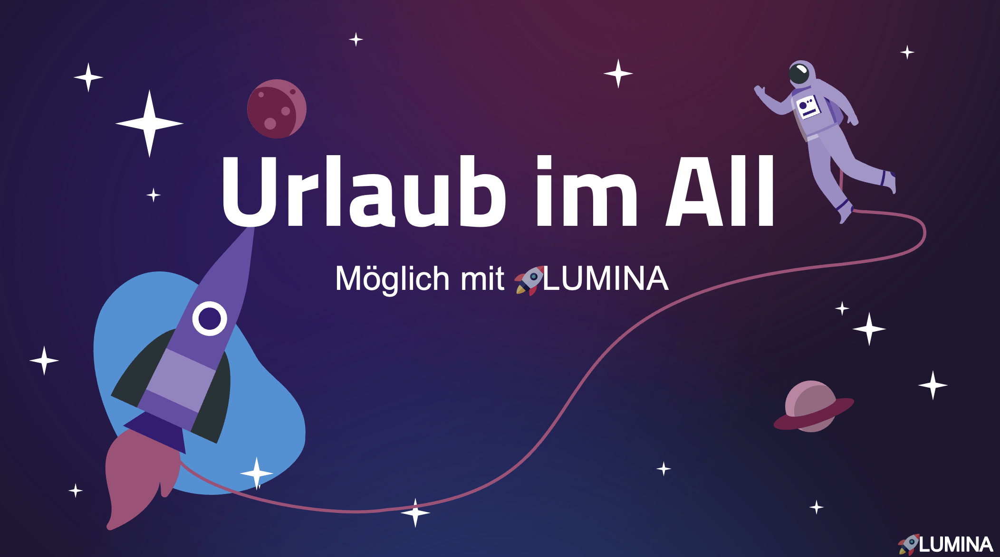

# LUMINA: *Raumfahrterlebnisse der Zukunft*

HWG Ludwigshafen – IBAIT ATdIT 2, Projektgruppe 3

***Entwicklung eines innovativen Softwaresystems für atemberaubende Erlebnisse im Weltraum.***

Dozierende: *Andreas Heck und Patrick Gutgesell*  
Gruppenmitglieder: *Leonie Bretscher, Vanessa Weber, Inas Mountassir, Oliver Simon & Jonas Juston*

---

---

## ✨ Projektbeschreibung ✨

#### **LUMINA** ist eine visionäre Softwareplattform, die sich der Aufgabe widmet, zukünftige Weltraumerlebnisse für Tourist:innen einmalig und immersiv zu gestalten. 

#### Wir garantieren maximale Sicherheit während Ihres Raumflugs – kombiniert mit interaktiven Unterhaltungsmöglichkeiten und dem einzigartigen Erlebnis eines echten Weltraumspaziergangs.

---

## 🚀 Warum LUMINA eine Investition wert ist 🚀 

Mit **LUMINA** heben wir das Kundenerlebnis im Weltraumtourismus auf ein neues Level:

- **🎯 Personalisierte Betreuung & Service**  
  Höhere Kundenzufriedenheit durch individuelle Profile und maßgeschneiderte Angebote.  

- **🧑‍🚀 Optimierte Crew-Arbeit**  
  Bessere Transparenz über Kundenwünsche und eine effizientere Betreuung an Bord.  

- **💸 Neue Ertragsmöglichkeiten**  
  Zusatzeinnahmen durch exklusive Upgrades und individuell buchbare Aktivitäten.  

**LUMINA** vereint Kundenerlebnis, Servicequalität und Effizienz – ein innovativer Schlüssel zu nachhaltigem Wachstum im Weltraumtourismus.

---

## 📚 Technische Mission: Unser LUMINA-Wiki 📚

#### Jede erfolgreiche Mission braucht ein starkes Kontrollzentrum.  
#### In unserem **[LUMINA-Wiki](https://github.com/Solimon12/ATdIT2_IBAIT23_G3_InFlight/wiki)** findet man alle wichtigen technischen Unterlagen, die unser Projekt tragen.
---

## 📄 Disclaimer 📄

Die Eintragung der Zeitslots durch die Bodencrew erfolgt **im Voraus** und wird in **einstündigen Intervallen** organisiert. Überschneidungen werden dabei **ausgeschlossen.** Die Passagiere haben die Möglichkeit, ihren bevorzugten Slot während des Flugs zu buchen.

Der Weltraumausflug beinhaltet einen einmaligen **Flug um die Erde.**

Alle relevanten **Gesundheitsdaten** sowie **individuelle Sonderwünsche** werden im Vorfeld abgefragt und dokumentiert.  
Die im Rahmen der am Ende der Reise durchgeführten Umfrage gewonnenen Informationen werden im Anschluss ausschließlich an die Abteilung für **Customer Satisfaction & Improvement** übermittelt. Dort dienen sie der Auswertung sowie der kontinuierlichen Weiterentwicklung des Programms.

---

## ❓ Fragen? ❓

Bei Fragen melde dich gerne per Mail:  

| **Name**           | **Jobbezeichnung**        | **E-Mail**                          |
|--------------------|---------------------------|-------------------------------------|
| Jonas Juston       | Informationsarchitekt     | jonasmaximilianwilhelm.juston@studmail.hwg-lu.de          |
| Oliver Simon       | Softwarearchitekt         | OliverMichele.Simon@studmail.hwg-lu.de|
| Vanessa Weber      | Applikationsentwicklerin  | Vanessa.Weber1@studmail.hwg-lu.de            |
| Leonie Bretscher   | UI & Doku Spezialistin    | leonie.bretscher@studmail.hwg-lu.de               |
| Inas Mountassir    | Leiterin Prozessanalyse   | inas.mountassir@studmail.hwg-lu.de      |

---

